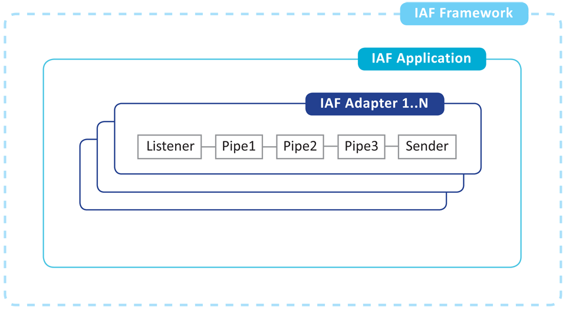

Releases
========

Upcoming:

- ...

[Commits](https://github.com/ibissource/iaf/compare/v5_5...HEAD)
[JavaDocs](http://www.ibissource.org/iaf/maven/apidocs/index.html)

5.5:

- Also when not transacted don't retrow exception caught in JMS listener (caused connection to be closed and caused possible other threads on the same listener to experience "javax.jms.IllegalStateException: Consumer closed").
- Tweaked error logging and configuration warnings about transactional processing.
    - Show requirement for errorStorage on FF EsbJmsListener as configuration warning instead of log warning on every failed message.
    - Removed logging error "not transacted, ... will not be retried" and warning "has no errorSender or errorStorage, message ... will be lost" (when a listener should run under transaction control (ITransactionRequirements) a configuration warning is already shown).
    - Removed logging error "message ... had error in processing; current retry-count: 0" (on error in pipeline an appropriate action (e.g. logging) should already been done).
    - Don't throw RCV_MESSAGE_TO_ERRORSTORE_EVENT and don't log "moves ... to errorSender/errorStorage" when no errorSender or errorStorage present.
    - Removed some unused code and comments like ibis42compatibility.
    - Renamed var retry to manualRetry for better code readability.
- Prevent java.io.NotSerializableException when the application server wants to persist sessions.
- Prevent problems with control characters in Test Tool GUI (replace them with inverted question mark + "#" + number of character + ";").
- Alpha version of new design Ibis console.
- Better support for Active Directory and other LdapSender improvements.
    - Make "filter" on LDAP error/warning messages work for AD too.
    - Added unicodePwd encoding.
    - Added changeUnicodePwd operation.
    - Added challenge operation to LdapSender (LdapChallengePipe has been deprecated).
    - Made it possible to specify principal and credentials as parameters.
    - Set errorSessionKey to errorReason by default.
    - Cleaned debug logging code and exclude password from being logged.
- Fixed a lot of javadoc warnings.
- Introduction of XmlFileElementIteratorPipe; streamed processing of (very large) xml files
- Better integration of Maven and Eclipse (using Kepler SR2).
- added "Transaction Service" to console function "Show Security Items", and added configuration warning "receiver/pipeline transaction timeout exceeds system transaction timeout"

[Commits](https://github.com/ibissource/iaf/compare/v5_4...v5_5)

5.4:

- First steps towards running IBISes on TIBCO AMX (as WebApp in Composite)
- added "Used SapSystems" to console function "Show Security Items"
- prevent OutOfMemoryError in console function "Adapter Logging" caused by a lot of files in a directory
- added facility to hide properties in console functions "Show configuration" and "Show Environment variables"
- Fixed problems with XSD's using special imports.
- Removed unused code which generates a NPE on JBoss Web/7.0.13.Final.
- Replace non valid xml characters when formatting error message.
- Made it possible to add http headers when using a HttpSender.
- Fixed exception in file viewer when context root of IAF instance is /.
- Bugfix addRootNamespace.
- Made it possible to override the address location in the generated WSDL.
- Possibility to dynamically load adapters.

[Commits](https://github.com/ibissource/iaf/compare/v5_3...v5_4)

5.3:

- Better DB2 support.
- Some steps towards making a release with Maven.
- First steps towards dynamic adapters.
- Specific java class, which returns Tibco queue information in a xml, is extended with more information.
- On the main page of the IBIS console ("Show configurationStatus") for each RestListener a clickable icon is added (this replaces separate bookmarks).

[Commits](https://github.com/ibissource/iaf/compare/v5_2...v5_3)

Ibis AdapterFramework
=====================

Build adapters using XML configuration. Build application using adapters.

Small XML configuration example which defines an adapter:

	<adapter name="HelloWorld" description="Little example">
		<receiver className="nl.nn.adapterframework.receivers.GenericReceiver" name="HelloWorld">
			<listener className="nl.nn.adapterframework.receivers.JavaListener" name="HelloWorld"/>
		</receiver>
		<pipeline firstPipe="HelloWorld">
			<exits>
				<exit path="EXIT" state="success"/>
			</exits>
			<pipe name="HelloWorld" className="nl.nn.adapterframework.pipes.FixedResult" returnString="Hello World">
				<forward name="success" path="EXIT"/>
			</pipe>
		</pipeline>
	</adapter>

Mailing list and IRC
====================

The Ibis community can be contacted via
https://groups.google.com/d/forum/ibissource. You can join this mailing list by 
sending a message to ibissource+subscribe@googlegroups.com. Or try to find
somebody online on IRC using the
[web interface](http://irc.codehaus.org/?channels=ibis&uio=d4) or an
[IRC client](irc://irc.codehaus.org/ibis).

Eclipse
=======

- Download
  [Eclipse Kepler SR2](http://eclipse.org/downloads/packages/eclipse-ide-java-ee-developers/keplersr2)
- Unzip and start Eclipse.
- Close Welcome.
- Make sure Maven is able to access the internet. E.g. when behind a proxy:
  Window, Preferences, Maven, User Settings, settings.xml should exist and
  contain proxy configuration.
- Window, Open Perspective, Other..., Git, OK, Clone a Git repository,
  URI: https://github.com/ibissource/iaf.git, Next, Next, Finish.
- Right click iaf, Import projects..., Next, Finish.
- Window, Open Perspective, Other..., Java EE.
- Servers, No servers are available. Click this link to create a new server...,
  Apache, Tomcat v7.0 Server, Next, Browse..., select the root folder of a
  Tomcat installation (when not available download
  [Tomcat](http://tomcat.apache.org/) (version 7.0.22 is known to work, but
  other version are expected to work too)), OK, Finish.
- Double click Tomcat v7.0 Server at localhost, Open launch configuration,
  Arguments, VM arguments, add -Dapplication.server.type=TOMCAT6, OK, Modules,
  Add Web Module..., iaf-example, OK, File, Save
- Right click Tomcat v7.0 Server at localhost, Start.
- Browse the IAF console at
  [http://localhost:8081/iaf-example/](http://localhost:8081/iaf-example/).

IntelliJ
========

- Clone this any way you like. E.g. at the commandline: git clone git@github.com:ibissource/iaf.git
- File -> Open project, and select the pom.xml which just appeared.
- To use git via intellij you need to install the git and/or github plugin.
- You can add a tomcat configuration via Run-> Edit Configuration -> + -> Tomcat Server -> Local -> Add example webapp under deployments tab.
- Run it

Command-line interface
======================

- git clone https://github.com/ibissource/iaf
- cd iaf/core
- mvn
